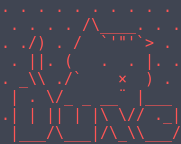

<h4>Duxe</h4>

<b>Duxe</b> is an information gathering tool. it can discover subdomains with online open tool no need to brutforce for the firste time of gathering information, search with shodan, make nmap test, get what CMS is using.
 
<h5>Requirement:</h5>

<a href="https://shodan.readthedocs.io/en/latest/index.html">Shodan</a>: you can install it <code>pip install shodan</code> 
you can do <code>pip install -r requirements.txt</code>

<h5>Usage:</h5>
<code>python duxe.py [-h] -host HOST [-nmap] [-robot] [-log] [-tor]</code>
